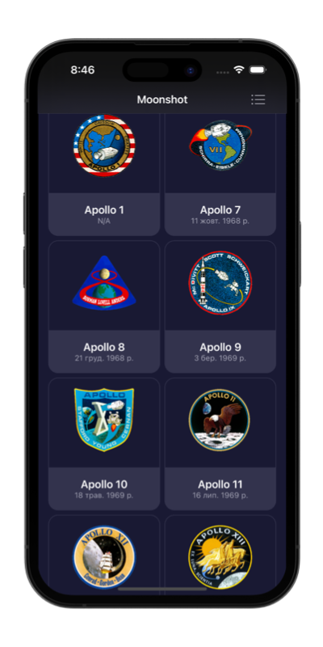

#   Moonshot

### Project 9 
##### Author: *[MatviiArtemenko](https://github.com/100DaysOfSwiftUI-MatviiArtemenko)*

##### 100DaysOfSwiftUI form *[@twostraws](https://twitter.com/twostraws "twostraws twitter page")*

##### Follow along: *[100DaysOfSwiftUI](https://www.hackingwithswift.com/100/swiftui "Hacking with Swift")*

---

> *This app is the most complex one we’ve built so far. Yes, there are multiple views, but we also strayed away from lists and forms and into our own scrolling layouts, using `GeometryReader` to get precise sizes to make the most of our space.   You’re also now starting to see how useful `Codable` is: its ability to decode a hierarchy of data in one pass is invaluable, which is why it’s central to so many Swift apps.*

---

## &nbsp; 📚 Covered topics

  GeometryReader,more Codable 

---
## &nbsp; 🎖 Challenge
* [x] Add the launch date to `MissionView`, below the mission badge. You might choose to format this differently given that more space is available, but it’s down to you.

* [x] Extract one or two pieces of view code into their own new SwiftUI views – the horizontal scroll view in `MissionView` is a great candidate, but if you followed my styling then you could also move the `Rectangle` dividers out too.

* [x] For a tough challenge, add a toolbar item to `ContentView` that toggles between showing missions as a grid and as a list. 
 

---
## &nbsp; 📲 Screenshoot

  
  
  

---
##  &nbsp; 🔍 &nbsp; Resources 

* [Hacking With Swift - Moonshot](https://www.hackingwithswift.com/books/ios-swiftui/moonshot-wrap-up)
* [Apple documentation - GeometryReader](https://developer.apple.com/documentation/swiftui/geometryreader/)
